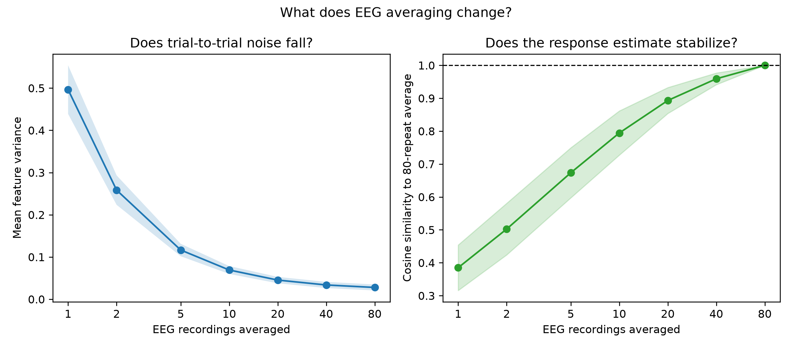
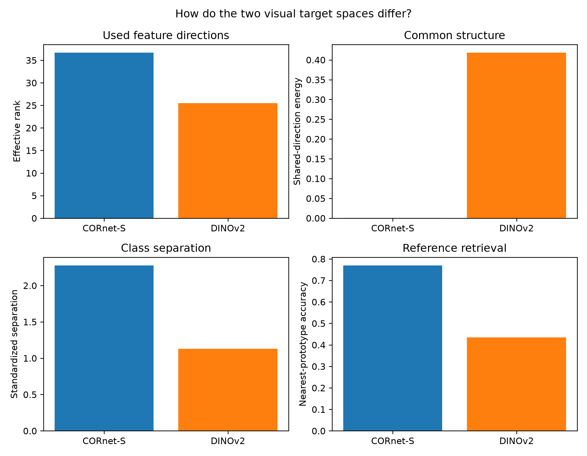
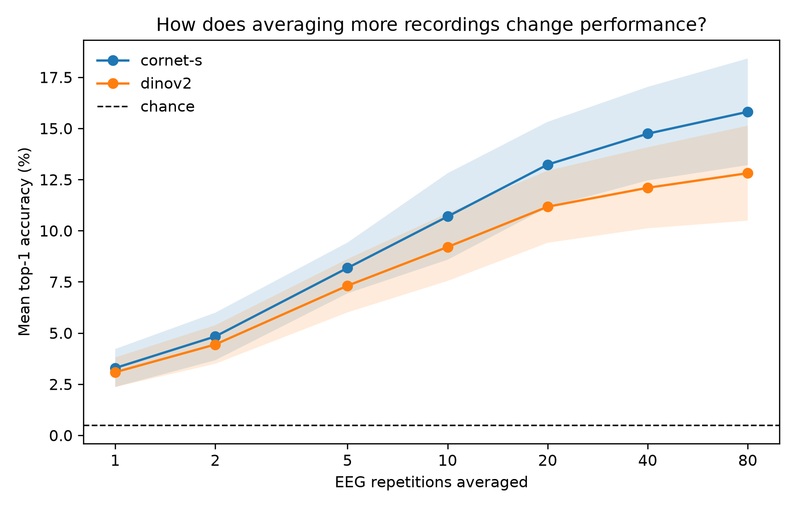
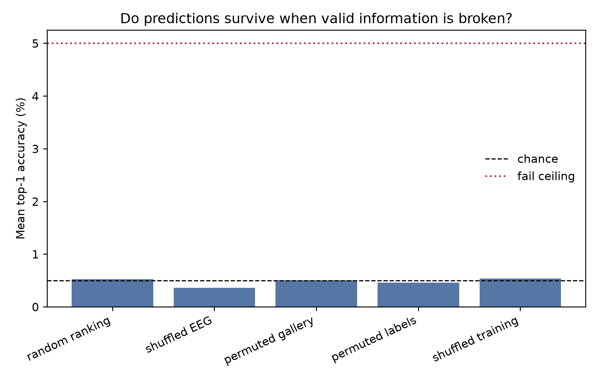
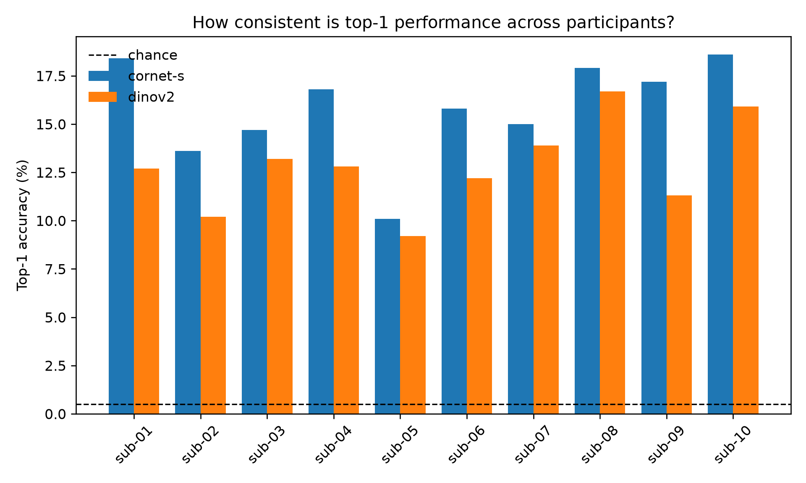
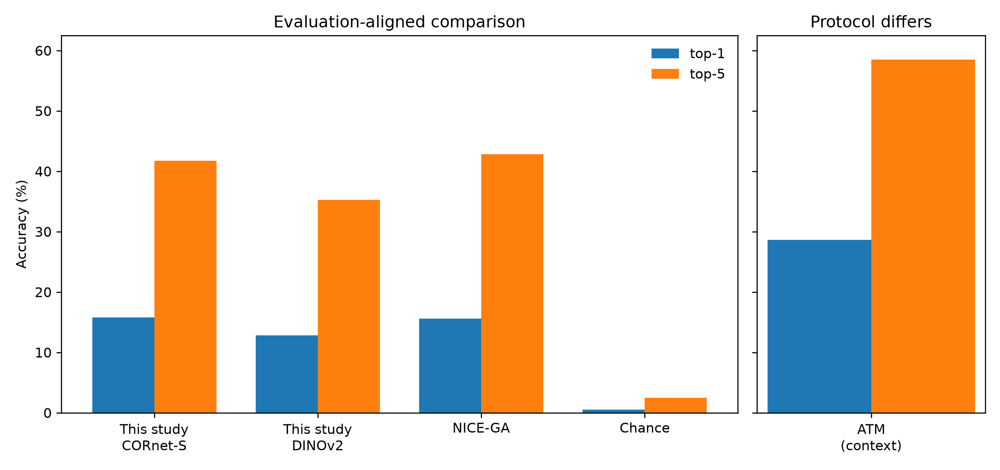

# NICE-style concept decoding from averaged EEG

## 1. Research question and answer

This study asks whether a simple participant-specific model can identify a viewed **concept** after
80 EEG recordings of the same test image are combined. For each query, the model chooses from 200
concept templates constructed from other images. The image used to record the EEG is never in the
gallery.

The answer is yes, well above chance. CORnet-S reached **15.81% top-1** and **41.76% top-5**;
DINOv2 reached **12.81%** and **35.23%**. Chance is 0.50% and 2.50%. CORnet-S is almost identical
to NICE-GA's published 15.60% top-1 and slightly below its 42.80% top-5 under the aligned evaluation
structure [Song et al., 2024](https://openreview.net/forum?id=dhLIno8FmH).

The result concerns stable information recoverable after many repeated presentations. It does not
show what a system could decode from one recording in real time.

## 2. Dataset and preprocessing

The EEG comes from the THINGS-EEG2 stimulus design [Gifford et al.,
2022](https://doi.org/10.1016/j.neuroimage.2022.119754), distributed here in BraVL-format arrays
[Du et al., 2023](https://doi.org/10.1109/TPAMI.2023.3263001). Ten participants viewed natural
images drawn from the THINGS database [Hebart et al.,
2019](https://doi.org/10.1371/journal.pone.0223792).

An EEG trial is a grid: electrodes by time samples. This study keeps 17 electrodes and samples
27–59 inclusive. There are 33 retained samples, so each row contains `17 × 33 = 561` values. This
interval and channel set were inherited from the established pipeline and frozen before the final
evaluation. Changing them after inspecting test accuracy would tune the method to the answers.

Training contains 16,540 rows covering 1,654 concepts and ten images per concept. Each row is the
archive's average of four presentations of one image. Test data starts with 16,000 rows: 80 EEG
recordings for each of 200 held-out stimuli.

The 80 test rows belonging to one stimulus are identified by an immutable stimulus ID and averaged
value by value. Labels only check the mapping. Physical row position is never used to decide which
trials belong together. This produces 200 queries of 561 values each.

Averaging reduces activity that varies randomly between repetitions and preserves activity that is
consistent. This usually improves signal-to-noise ratio. Its cost is equally important: it removes
trial-to-trial variation and assumes that 80 recordings of the same stimulus are already available
and correctly grouped.

## 3. Why this evaluation was chosen

NICE is the closest reproducible published comparison because both studies use participant-specific
models, four-presentation training averages, 80-presentation test averages, 200 unseen concepts,
independent concept templates, cosine top-1/top-5 scoring, five runs, and ten-participant
aggregation. Matching these performance-defining choices makes the scores interpretable beside one
another. It does not make the model architectures identical.

ATM is useful context but not a direct comparison. ATM retains four training repetitions as
separate examples and reports the highest test performance reached during training [Li et al.,
2024](https://arxiv.org/abs/2403.07721). The available archive cannot reproduce that training unit,
and selecting a checkpoint using test accuracy conflicts with this study's leakage boundary.

### Concept gallery

For each of the 200 concepts, all available THINGS images were considered. Every image used to
record EEG was excluded by both filename and SHA-256 content hash. Remaining image features were
normalized, averaged within concept, and normalized again. The frozen gallery contains 2,695 images,
at least 11 per concept, and exactly one template per concept. It has zero filename or content-hash
overlap with the 16,740 EEG stimulus images checked.

This gallery tests concept recognition: the correct answer represents the same kind of object, but
is constructed from different pictures. It avoids the easier shortcut of matching the precise image
that produced the EEG.

## 4. Exploratory data analysis

EDA was performed to understand scale, noise, dimensionality, class geometry, and possible failure
modes before interpreting accuracy. The [metric dictionary](appendices/metrics.md) explains every
quantity, why it was measured, how to read it, and what it cannot prove. Full seed-level values are
in the [results directory](results/nice/).

### Main observations

| Observation | Interpretation supported by the measurement | Important caution |
| --- | --- | --- |
| Every expected row is finite and class counts are balanced. | Missing values or class imbalance do not explain the result. | This does not verify upstream preprocessing. |
| Averaged test EEG has lower variation than the original repetitions. | Repetition averaging removes substantial trial-specific noise. | Lower variance is not automatically more neural information. |
| Similarity to the full average rises with repetition count. | Larger subsets give increasingly stable estimates of each response. | The full average is a reference, not ground truth. |
| First-40 and last-40 averages agree strongly. | The stable response is reproducible across independent halves. | Both halves come from the same participant and session design. |
| CORnet-S has higher effective rank and stronger reference prototype separation. | Its geometry may be easier for a linear EEG decoder to reach. | Geometry alone does not prove why final accuracy differs. |
| DINOv2 has a strong common direction and greater between-class similarity. | Many DINOv2 vectors share structure that is not discriminative for this task. | A nonlinear decoder or different layer could use the space differently. |

The repetition curve is a diagnostic, not a model-selection tool. Accuracy increases smoothly from
small subsets toward the locked 80-repeat endpoint. This pattern is consistent with noise reduction
and is difficult to reconcile with a single row-order shortcut.

The left panel asks whether feature variation falls as more recordings are combined. The right asks
whether each subset approaches the full 80-repeat estimate. Lines are participant means and bands
show one participant-level sample standard deviation. Falling variance and rising similarity show
stabilization; they cannot establish that every stable component is neural.

These four reference-data summaries use their natural units rather than combining unlike metrics on
one scale. CORnet-S spreads information across more directions, has almost no global common
direction, separates concepts more strongly, and supports more accurate nearest-prototype retrieval.
They help explain why CORnet-S may suit a linear decoder, but they are descriptive rather than causal.

The horizontal dashed line is 0.5% top-1 chance. Points average the predeclared subsets across
participants and seeds; bands show participant-level variation. The curve shows why the 80-repeat
task performs well, but also why its result should not be interpreted as ordinary real-time use.

## 5. Visual representations and model selection

The decoder does not directly output a word. It predicts a point in a visual feature space, then
selects the nearest concept template.

### Why CORnet-S and DINOv2

CORnet-S is a compact recurrent convolutional network designed as a simplified model of the primate
ventral visual pathway [Kubilius et al., 2019](https://doi.org/10.1101/408385). It was the established
visual target in the inherited pipeline and provides a relatively compact 100-dimensional target
after reference-fitted PCA.

DINOv2 is a self-supervised vision transformer trained to produce general image representations
[Oquab et al., 2024](https://doi.org/10.48550/arXiv.2304.07193). It was tested because broad semantic
representations might make unseen concepts easier to distinguish. Eight candidates were declared in
advance: layers 3, 6, 9, and 12, each using either the CLS token or the mean of patch tokens. Selection
used only category-disjoint folds from the 1,654 training concepts. The held-out 200 queries were not
loaded for this choice.

### Linear decoder and transformations

Ridge regression learns a linear map from the 561 EEG values to visual features. It penalizes very
large coefficients, reducing overfitting when inputs are correlated. A linear model is intentionally
limited: performance is easier to audit, and differences between visual spaces are not hidden inside
a powerful nonlinear network.

The reference-only search considered:

- **EEG PCA:** no compression, 64, or 128 components. PCA keeps directions explaining the most
  reference-data variation and can discard noisy or redundant directions.
- **Semantic PCA:** 32, 64, or 100 components. This reduces the number of visual values the decoder
  must predict.
- **Whitening:** optional rescaling of retained semantic components to equal reference variance. It
  prevents a few high-variance directions from dominating the fit.
- **Leading-component removal:** zero, one, or two shared semantic directions removed. This tests
  whether broad common structure obscures concept-specific differences.
- **Ridge strength:** 10, 100, or 1,000. Larger values constrain the decoder more strongly.

A change was retained only when it improved all three category-disjoint reference folds. The
[selection appendix](results/README.md) links the exact participant/seed settings and the summarized
evidence. In the final selections, whitening was retained for all 50 CORnet-S models, while 17 also
compressed its 100 visual dimensions to 64. DINOv2 was always compressed from 768 dimensions (46
models selected 100 and four selected 64), while whitening was mixed (28 of 50). EEG PCA was absent
in 45 of 50 CORnet-S and 37 of 50 DINOv2 models. No CORnet-S model and only three DINOv2 models
removed a leading component. These are reference-fold observations, not conclusions selected from
test accuracy.

### Why CORnet-S performed better

CORnet-S exceeded DINOv2 by 3.00 percentage points top-1 and 6.53 points top-5. The measured visual
geometry offers plausible reasons: CORnet-S reference features have higher effective rank, lower
shared-direction energy, greater standardized class separation, and stronger nearest-prototype
accuracy. A linear decoder may therefore find CORnet-S's discriminating directions more accessible.

This is not proof of a biological advantage. DINOv2 may contain richer information organized in a
form that a linear Ridge model, 17 electrodes, or this time interval cannot exploit. The visual
encoder, target dimension, and template construction also differ.

### Possible 50/50 combination

A useful future test is fixed score-level fusion. For each query, independently normalize the 200
CORnet-S cosine scores and the 200 DINOv2 cosine scores, multiply each set by 0.5, add corresponding
candidate scores, and rank the sums. “50/50” means equal influence on the final decision; it does
not mean joining half of each feature vector. This has not been evaluated here. Its rule must be
declared in advance or selected only with reference folds, never chosen because it improves the
held-out 200-query result.

## 6. Final evaluation

After all choices are frozen, one model per participant and visual target is fitted on all 16,540
training rows. Each of the 200 averaged EEG queries predicts one visual vector. Cosine similarity
compares its direction independently with all 200 templates. The closest template is rank 1.

Top-1 asks whether the correct concept is first. Top-5 asks whether it appears anywhere in the first
five. Cosine is primary because it matches NICE and lets each query stand alone. CSLS is reported
only as a secondary diagnostic because it adjusts a query using the complete query batch.

The complete fitting and reference-only selection procedure is repeated for seeds 17, 29, 43, 71,
and 101. Runs are averaged within participant first. The study mean, sample standard deviation, and
Student-t 95% confidence interval are then calculated across ten participant means. Runs, concepts,
and EEG rows are not treated as extra people.

## 7. Leakage controls

Leakage means that information about the held-out answers influences fitting, selection, alignment,
or scoring. Each control deliberately breaks one legitimate information path. If accuracy remains
high after the relevant information is broken, a shortcut is likely. The full implementations and
interpretations are in the [leakage appendix](appendices/leakage-controls.md).

Across nine broken-information control families, mean top-1 was **0.476%**, close to 0.5% chance.
The largest individual result was **2.5%**, below the predeclared 5% failure ceiling. Independent
cosine code reproduced every production rank, row reordering changed nothing, the gallery overlap
audit found zero matches, and fitted bundle hashes remained unchanged during evaluation.

The dashed line marks analytical chance and the red dotted line marks the fail ceiling. Returning to
chance supports the absence of the repository-controlled shortcuts tested. It cannot certify how
the distributed BraVL arrays were constructed before this repository received them.

## 8. Results and uncertainty

| Visual target | Top-1 | Top-5 | Top-1 95% CI | Top-5 95% CI |
| --- | ---: | ---: | ---: | ---: |
| CORnet-S | **15.81%** | **41.76%** | 13.95–17.67% | 38.78–44.74% |
| DINOv2 | 12.81% | 35.23% | 11.15–14.47% | 32.26–38.20% |
| Chance | 0.50% | 2.50% | — | — |

For a 200-query participant run, 15.81% corresponds to about 32 correct first choices and 41.76%
to about 84 queries with the answer in the first five. These are intuitive equivalents of aggregate
percentages, not literal fractional counts from one participant.

The participant-paired CORnet-S advantage is 3.00 points top-1 and 6.53 points top-5. The exact
sign-flip p-value is 0.00195 for both; Holm adjustment gives 0.00391. A sign-flip test asks whether
participant differences could plausibly have equally likely positive or negative signs under no
method difference. Holm correction controls the family of two predeclared metric comparisons.

Each bar is a participant's mean across five runs. The plot shows that the conclusion is not driven
by treating 200 concepts or 16,000 recordings as independent participants.

## 9. Literature comparison

### Directly aligned evaluation

| Study | Participants | Train/test averaging | Gallery | Visual target | Decoder | Runs | Top-1 | Top-5 |
| --- | ---: | --- | --- | --- | --- | ---: | ---: | ---: |
| This study, CORnet-S | 10 | 4 / 80 | 200 non-EEG concept templates | CORnet-S | Ridge | 5 | **15.81%** | 41.76% |
| This study, DINOv2 | 10 | 4 / 80 | 200 non-EEG concept templates | DINOv2 | Ridge | 5 | 12.81% | 35.23% |
| NICE-GA | 10 | 4 / 80 | 200 non-EEG concept centres | CLIP ViT-L/14 | Contrastive + graph attention | 5 | 15.60% | **42.80%** |
| Chance | — | — | 200 candidates | — | — | — | 0.50% | 2.50% |

CORnet-S closely matches NICE-GA despite using 17 rather than 63 channels and a linear decoder.
That is encouraging, but not evidence that the models are equivalent: their EEG intervals, image
encoders, channel coverage, and training objectives differ.

### Context only

ATM reports 28.64% top-1 and 58.47% top-5, but it keeps training repetitions separate and reports
the best test result during training. Its number is therefore informative context, not a fair row in
the direct table. The [protocol ledger](results/nice/primary-source-protocol-ledger.csv) records the
source location and eligibility decision for every literature value.

## 10. Interpretation, strengths, limitations, and future work

The central finding is that stable EEG information can support 200-way concept retrieval after
extensive averaging, even with a simple linear decoder and reduced electrode set. Strong performance
does not mean that one brief EEG response is sufficient.

Strengths include immutable ID alignment, an independently sourced gallery, reference-only model
selection, five predeclared runs, participant-level statistics, two ranking implementations, and a
broad negative-control suite.

Limitations include the 80-recording requirement, only ten participants, 17 channels, inherited
time selection, linear decoding, and architectural differences from NICE. Most importantly, the
repository cannot reconstruct preprocessing that occurred when the distributed BraVL arrays were
created. Local leakage boundaries pass, but upstream provenance remains unresolved.

Fruitful predeclared follow-ups are: reconstructing the arrays from raw THINGS-EEG2 recordings;
testing fixed 50/50 score fusion; testing nonlinear decoders only within nested reference folds;
repeating the analysis with all 63 electrodes and matched time windows; and assessing how well a
decoder generalizes to different sessions or participants. Each should preserve the independent
concept gallery and keep held-out accuracy unavailable during selection.

## 11. Reproducibility and provenance

The [reproducibility appendix](appendices/reproducibility.md) gives the executable stages and release
checks. Machine-readable participant results, EDA, settings, controls, manifests, literature fields,
and SHA-256 publication hashes are under [`docs/results/nice/`](results/nice/). Raw EEG, images,
model weights, fitted bundles, and row-level predictions are intentionally not committed.
